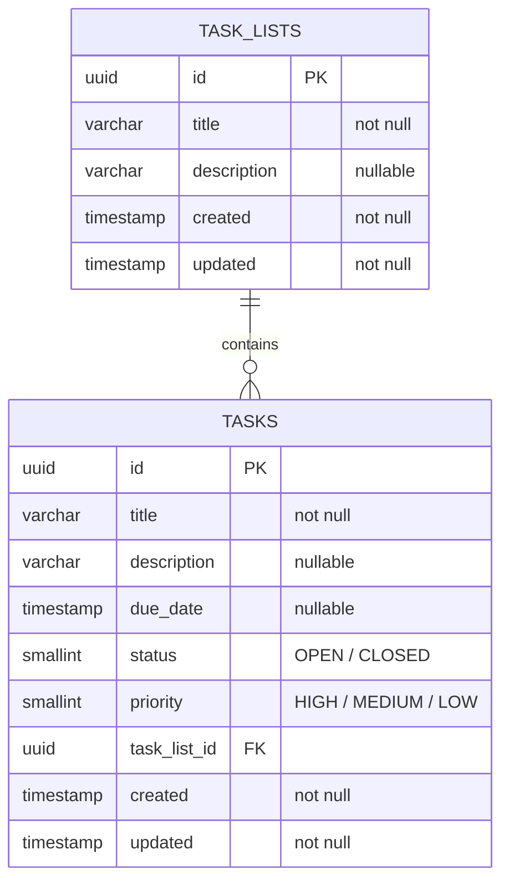

# Task Manager API

A REST API for managing task lists and tasks, built with **Spring Boot 4**, **Spring Data JPA** and
**PostgreSQL** running in Docker.

Built as a hands-on way to learn the Spring Boot ecosystem end to end: layered architecture, JPA
persistence, containerized databases, transactions, and exposing a clean REST API.

<p align="left">
  
  
  
  
  
  
</p>

---

## What the API does

- Full CRUD over **task lists**
- Full CRUD over **tasks**, nested under the list they belong to
- Task **priorities** (`HIGH`, `MEDIUM`, `LOW`) and **status** (`OPEN`, `CLOSED`)
- Optional **due dates**, plus automatic `created` / `updated` timestamps
- **Progress per list** (ratio of closed tasks), computed on the fly and returned in the response
- **Centralized error handling** returning a consistent JSON error body
- **PostgreSQL in Docker**, started automatically with the application
- **H2 in-memory database** for the test profile, so tests never touch real data

---

## Tech stack

| Concern | Technology |
|---|---|
| Language | Java 21 |
| Framework | Spring Boot 4.1.1 (Web MVC, Data JPA) |
| Persistence | Hibernate / JPA |
| Database | PostgreSQL (Docker), H2 in-memory for tests |
| Infrastructure | Docker Compose |
| Build | Maven (wrapper included) |

---

## Architecture

The API follows a classic layered architecture, where each layer has a single responsibility:

```
HTTP request
    │
    ▼
┌─────────────────┐
│   Controller    │  REST endpoints, path variables, request/response bodies
└────────┬────────┘
         │  DTO ⇄ Entity (Mapper)
         ▼
┌─────────────────┐
│    Service      │  Business rules, validation, transactions
└────────┬────────┘
         │
         ▼
┌─────────────────┐
│   Repository    │  Spring Data JPA, query derivation
└────────┬────────┘
         │
         ▼
┌─────────────────┐
│   PostgreSQL    │  Running in a Docker container
└─────────────────┘
```

- **Controllers** (`controllers/`) only speak HTTP. They never touch the database directly.
- **Services** (`services/`, `services/impl/`) hold the business rules — validating that a title is present,
  that IDs match, that a task belongs to the list it is being requested from — and define transaction boundaries.
- **Repositories** (`repositories/`) extend `JpaRepository`, so most queries are derived from method names
  (`findByTaskListIdAndId`) with no SQL written by hand.
- **Mappers** (`mappers/`) translate between JPA entities and DTOs, so the database model never leaks into the API.
- **DTOs** (`domain/dto/`) are Java `record`s — the public contract of the API.

---

## Data model



One task list has many tasks (`@OneToMany` / `@ManyToOne`). Deleting a list cascades to its tasks,
and tasks are fetched lazily to avoid loading a whole list when it is not needed. The schema above is
not written by hand — Hibernate generates it from the entity classes (`spring.jpa.hibernate.ddl-auto=update`),
including the foreign key and the check constraints that keep the enum columns in range:

<details>
<summary><code>\d tasks</code> — the schema Hibernate produced</summary>

```
                              Table "public.tasks"
    Column    |              Type              | Nullable
--------------+--------------------------------+----------
 id           | uuid                           | not null
 created      | timestamp(6) without time zone | not null
 description  | character varying(255)         |
 due_date     | timestamp(6) without time zone |
 priority     | smallint                       | not null
 status       | smallint                       | not null
 title        | character varying(255)         | not null
 updated      | timestamp(6) without time zone | not null
 task_list_id | uuid                           |

Indexes:
    "tasks_pkey" PRIMARY KEY, btree (id)
Check constraints:
    "tasks_priority_check" CHECK (priority >= 0 AND priority <= 2)
    "tasks_status_check" CHECK (status >= 0 AND status <= 1)
Foreign-key constraints:
    FOREIGN KEY (task_list_id) REFERENCES task_lists(id)
```

</details>

---

## API reference

Base URL: `http://localhost:8080`

### Task lists

| Method | Endpoint | Description |
|---|---|---|
| `GET` | `/api/task-lists` | List all task lists |
| `POST` | `/api/task-lists` | Create a task list |
| `GET` | `/api/task-lists/{taskListId}` | Get a single task list |
| `PUT` | `/api/task-lists/{taskListId}` | Update a task list |
| `DELETE` | `/api/task-lists/{taskListId}` | Delete a task list and its tasks |

### Tasks

| Method | Endpoint | Description |
|---|---|---|
| `GET` | `/api/task-lists/{taskListId}/tasks` | List the tasks of a list |
| `POST` | `/api/task-lists/{taskListId}/tasks` | Create a task in a list |
| `GET` | `/api/task-lists/{taskListId}/tasks/{taskId}` | Get a single task |
| `PUT` | `/api/task-lists/{taskListId}/tasks/{taskId}` | Update a task |
| `DELETE` | `/api/task-lists/{taskListId}/tasks/{taskId}` | Delete a task |

### Creating a resource

```bash
curl -X POST http://localhost:8080/api/task-lists \
  -H "Content-Type: application/json" \
  -d '{"title": "Groceries", "description": "Things to buy this week"}'
```

```json
{
  "id": "1f0a6b9e-2c4d-4a11-9b0e-3f5c8a7d1e22",
  "title": "Groceries",
  "description": "Things to buy this week",
  "count": 0,
  "progress": null,
  "tasks": null
}
```

<!-- ─────────────────────────────────────────────────────────────
     IMAGE SLOT 2 — a POST in Postman, request body + JSON response
     The most important image in this README.


     ───────────────────────────────────────────────────────────── -->

### Computed fields

`count` and `progress` are not database columns — they are derived in the mapping layer from the tasks
belonging to the list, so the API can return useful information the schema does not store.

```bash
curl http://localhost:8080/api/task-lists
```

```json
[
  {
    "id": "1f0a6b9e-2c4d-4a11-9b0e-3f5c8a7d1e22",
    "title": "Groceries",
    "description": "Things to buy this week",
    "count": 4,
    "progress": 0.5,
    "tasks": [ ... ]
  }
]
```

<!-- ─────────────────────────────────────────────────────────────
     IMAGE SLOT 3 — a GET in Postman showing count and progress


     ───────────────────────────────────────────────────────────── -->

### Error handling

Invalid requests are caught by `GlobalExceptionHandler` and returned as `400 Bad Request` with a
consistent body, instead of leaking a stack trace:

```json
{
  "status": 400,
  "message": "Task List title must be present",
  "details": "uri=/api/task-lists"
}
```

<!-- ─────────────────────────────────────────────────────────────
     IMAGE SLOT 4 — the 400 response in Postman
     Send a task list with a blank title.


     ───────────────────────────────────────────────────────────── -->

---

## Running the project

### Prerequisites

- Java 21
- Docker and Docker Compose

### 1. Clone the repository

```bash
git clone https://github.com/Nicomoguel/Task-Manager.git
```

### 2. Start the database

The project includes `spring-boot-docker-compose`, so running the application **starts the PostgreSQL
container automatically**. To start it manually instead:

```bash
docker compose up -d
```

### 3. Run the API

```bash
./mvnw spring-boot:run
```

The API is available at `http://localhost:8080`.

### 4. Run the tests

```bash
./mvnw test
```

Tests run against an in-memory H2 database configured in `src/test/resources/application.properties`,
so the PostgreSQL data is never touched.

---

## Project structure

```
taskapp/
├── docker-compose.yml                  # PostgreSQL container
├── pom.xml                             # Maven dependencies
└── src/
    ├── main/
    │   ├── java/com/springapp/taskapp/
    │   │   ├── controllers/            # REST endpoints + global error handling
    │   │   ├── services/               # Business logic (interfaces + impl)
    │   │   ├── repositories/           # Spring Data JPA repositories
    │   │   ├── mappers/                # Entity ⇄ DTO conversion
    │   │   └── domain/
    │   │       ├── entities/           # JPA entities and enums
    │   │       └── dto/                # API contracts (records)
    │   └── resources/application.properties
    └── test/                           # Tests + H2 configuration
```

---

## What I learned

This project was a learning exercise, and these were the main takeaways:

**Spring Boot fundamentals**
Setting up a project from Spring Initializr, understanding starters and auto-configuration, and how
dependency injection through constructors wires the whole application together.

**Bringing up a server**
Going from an empty `main` method to an embedded server serving HTTP on port 8080, and understanding
what the framework does on startup — component scanning, bean creation, and mapping URLs to methods.

**Controller layer vs. service layer**
Probably the most valuable lesson. The controller's job is to translate HTTP into Java calls and back:
read path variables, deserialize the request body, return a response. The service's job is everything
that makes the application *do* something: validation, business rules, and orchestrating repository calls.
Keeping them separate means the business logic is testable without HTTP, and the API can change shape
without rewriting the rules behind it.

**JPA and persistence**
Mapping Java classes to database tables with `@Entity`, `@Table` and `@Column`; letting JPA generate UUID
primary keys; and modelling the one-to-many relationship between task lists and tasks with `@OneToMany`
and `@ManyToOne`. Also learned what lazy vs. eager fetching means in practice, and how cascade types
decide what happens to tasks when their list is deleted. Spring Data derives most of the queries from the
repository method names, so almost no SQL had to be written by hand.

**PostgreSQL**
Connecting Spring Boot to a real relational database through JDBC, configuring the datasource, and letting
Hibernate generate and update the schema from the entities instead of writing DDL by hand. Also learned to
point the test profile at a different database (H2) so tests are isolated and repeatable.

**What a container is, with Docker**
Instead of installing PostgreSQL on my machine, the database runs as an isolated container defined in
`docker-compose.yml` — image, port mapping, environment variables and restart policy. The same file gives
anyone cloning the repo an identical database in one command, and the whole thing can be thrown away and
recreated from scratch without leaving anything behind.

**CRUD operations**
Implementing the complete create / read / update / delete cycle for two related resources, and mapping each
operation to the right HTTP verb (`POST`, `GET`, `PUT`, `DELETE`) and the right URL, including nested
resources such as `/api/task-lists/{id}/tasks/{id}`.

**Designing and testing API calls**
Thinking about the API as a contract rather than as a set of methods: which status codes to return, what the
request and response bodies look like, how JSON is deserialized into Java objects and back, and how to
exercise every endpoint with `curl` and Postman.

**Transactions**
Understanding why `@Transactional` matters: operations that touch the database more than once — updating a
task and its parent list, or checking existence before deleting — must either complete entirely or roll back
entirely, so the database is never left in a half-updated state.

**DTOs and mappers**
Not exposing JPA entities directly through the API. DTOs define a stable contract and let the response carry
computed values — such as a task list's progress — that do not exist as columns in the database.

---

## Possible next steps

- User accounts and authentication (Spring Security + JWT)
- Bean validation (`@Valid`, `@NotBlank`) instead of manual checks in the services
- Integration tests for the controller and service layers
- Database migrations with Flyway or Liquibase
- OpenAPI / Swagger documentation generated from the controllers
- A Dockerfile for the API so the whole backend runs with a single `docker compose up`
